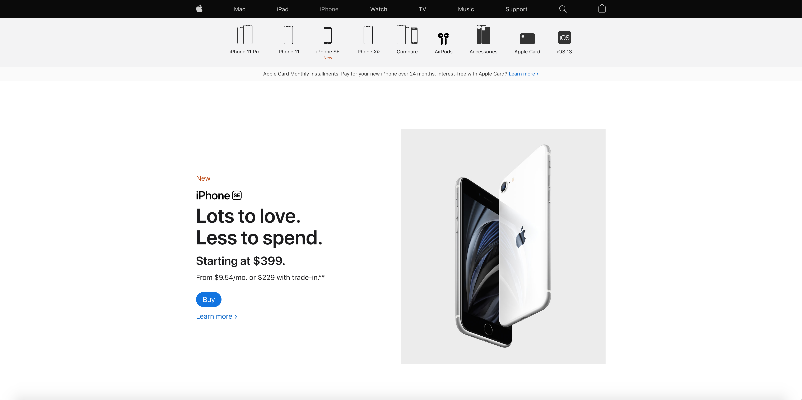

# Procesverslag
**Auteur:** Bo Smit

Markdown cheat cheet: [Hulp bij het schrijven van Markdown](https://github.com/adam-p/markdown-here/wiki/Markdown-Cheatsheet). Nb. de standaardstructuur en de spartaanse opmaak zijn helemaal prima. Het gaat om de inhoud van je procesverslag. Besteedt de tijd voor pracht en praal aan je website.

## Bronnenlijst
1. https://developer.mozilla.org/en-US/docs/Web/CSS/Using_CSS_custom_properties
2. https://codepen.io/simoneas02/pen/gmREyQ
3. -...-

## Eindgesprek (week 7/8)

-dit ging goed & dit was lastig-

**Screenshot(s):**

-screenshot(s) van je eindresultaat-

## Voortgang 3 (week 6)

-same as voortgang 1-

## Voortgang 2 (week 5)

-same as voortgang 1-
oefeningen scalable grid
of archumentatie
zoek yt responsive grid zonder media quiries

maak onderscheid tussen nav's met clas main nav

css tricks

css hover animaties etc

als je iets hebt gemaakt meteen updaten op github

https://developer.mozilla.org/en-US/docs/Web/CSS/clamp

## Voortgang 1 (week 3)

### Stand van zaken

-dit ging goed & dit was lastig-

**Screenshot(s):**

-screenshot(s) van hoe ver je bent-

### Agenda voor meeting

Vragen:
Root?
Flexbox
Geen divs wat wel?

### Verslag van meeting

Meerdere articles in een section
Een section is altijd groter

## Intake (week 1)

**Je startniveau:** blauw

**Je focus:** responsive

**Je opdracht:** https://www.neuralink.com/ of https://www.apple.com/

**Screenshot(s):**

 (images/neuralinkcom.png)

**Breakdown-schets(en):**

